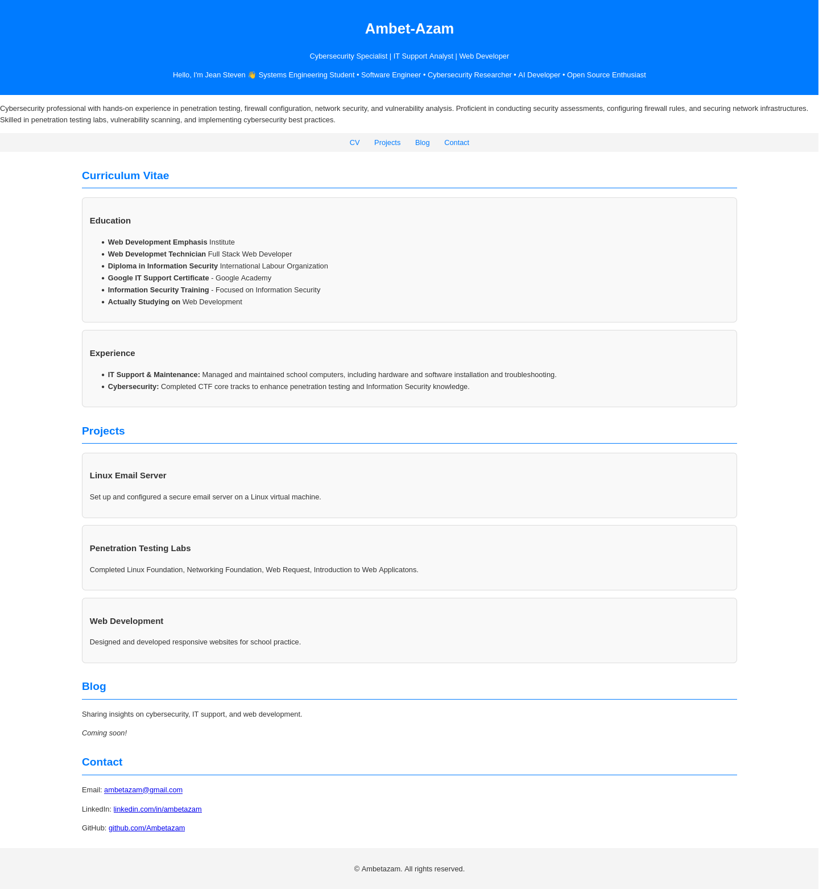

Personal Portfolio Website (2024)
Overview

This repository contains one of my early personal portfolio websites, originally developed in 2024 using HTML, CSS, and JavaScript.

The project was created as part of my learning journey in web development and served as a simple online portfolio to present my education, projects, technical interests, and contact information.

Although my current portfolio and development practices have evolved significantly, I keep this repository available as part of my learning history and to document my progression as a software engineer.

Features
Responsive single-page portfolio
Pure HTML, CSS, and JavaScript
Navigation menu
Curriculum Vitae section
Projects section
Blog placeholder
Contact information
Interactive project cards
Technologies
HTML5
CSS3
JavaScript (Vanilla)

No external frameworks or libraries were used.

Project Structure
.
├── index.html
└── README.md

Running the Project

Clone the repository:

git clone https://github.com/Ambetazam/HTMLPortoflio.git

Open the project directory:

cd HTMLPortoflio

Open the website in your browser:

xdg-open index.html

or simply double-click index.html.

No build process or web server is required.

Learning Objectives

This project helped me practice:

Semantic HTML
CSS layouts and styling
Responsive design principles
Basic DOM manipulation
Event handling with JavaScript
Structuring a personal portfolio
Historical Context

This repository represents an early stage of my software development journey.

Since then, my interests have expanded into:

Software Engineering
Backend Development
Cybersecurity Research
Artificial Intelligence
Linux System Administration
Cloud and Infrastructure
Open Source Development

Rather than replacing this project, I have chosen to preserve it as part of my public learning timeline.

Future Improvements

Although this repository is maintained primarily as an archive, possible future enhancements include:

Improved responsive design
Accessibility improvements
Dark mode
Modern CSS layout (Flexbox/Grid)
Project screenshots
GitHub Pages deployment
Updated portfolio content
License

This project is released under the MIT License unless otherwise specified.

Author

Jean Steven

Systems Engineering Student • Software Engineer • Cybersecurity Researcher • AI Developer • Open Source Enthusiast
